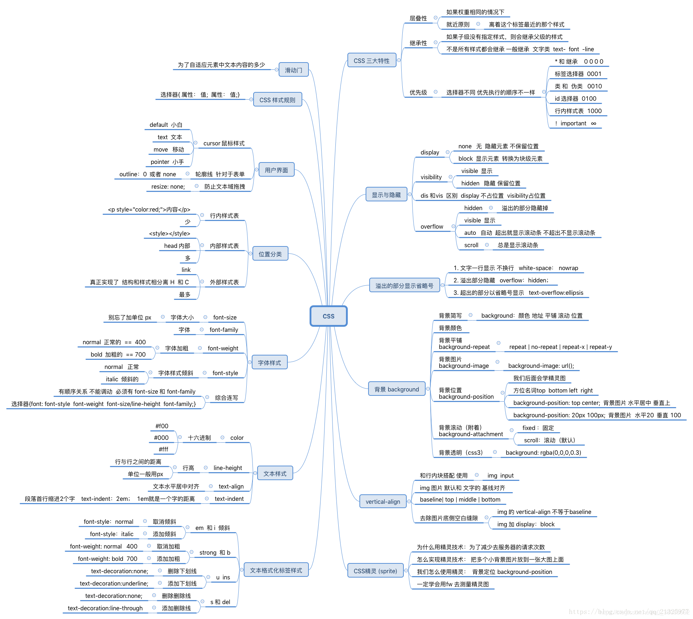
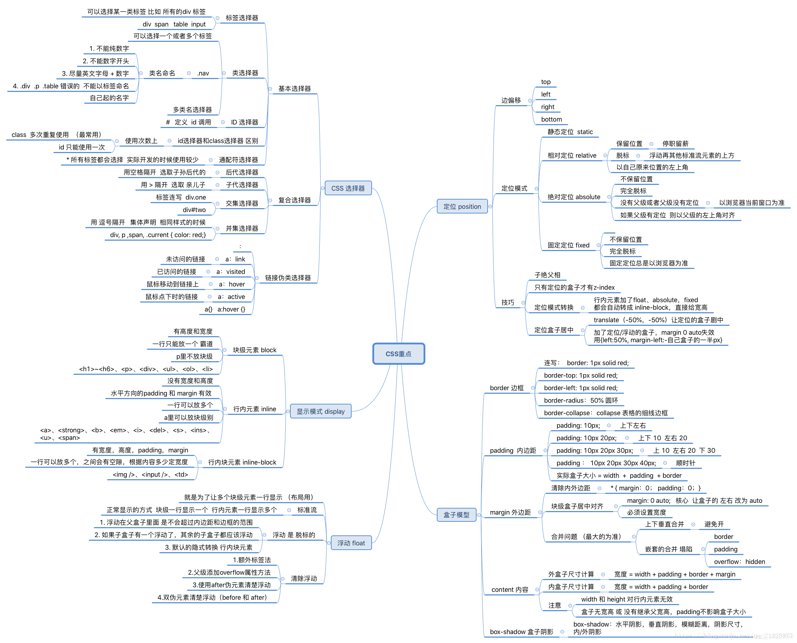
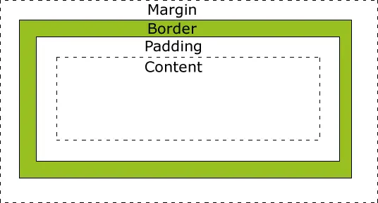

## CSS

> 没错图还是偷的，但是我认真筛选后才偷的，出自何处看下方参考链接:point_down:

### css 热议话题

*刚出来找实习工作那会儿，面试官还是会经常问起c3新特性啊，怪异盒模型啊。总觉得自己答得很棒，后来自己有机会面试其他面试者的时候，才发现面试官其实想听的不是我们说的那些，曾经的我只是略懂皮毛罢了:expressionless::expressionless:。曾经沧海难为水，了却巫山不是云啊*

#### 盒模型

盒模型有**标准盒模型**与**IE盒模型**（又称：怪异盒模型）。我们通过一张图去了解它们。

>**标准盒模型（box-sizing: content-box）：**指的是W3C标准盒模型，也是默认的**设置属性**在标准盒模型中，width 和 height 指的是内容区域（content）的宽度和高度。增加内边距、边框和外边距不会影响内容区域的尺寸，但是会增加元素框的总尺寸。

在标准盒模型中：盒子**占位**width = width + 2margin + 2padding + 2*border,高度与之一样。
盒子**真正的width** = width + 2padding + 2border。 margin不算！margin可以改变盒子占位的大小，但是盒子的宽高并没有改变，而是位置的改变！**通俗的说就是当我们css设置盒子的width后，content=width，content的内容不随padding与border的改变而改变**

>**IE盒模型（box-sizing: border-box）：**盒子设置的width包含了 border 和 padding。

当设定 width 后，继而改变 padding 和 border 值，不会改变盒子真正的 width 。**通俗点，css设置盒子的width后，content=width-/+(padding+border)。content的内容随padding与border的改变而改变**

### 参考链接

[css知识脑图](https://blog.csdn.net/m0_38053092/article/details/100162874)
