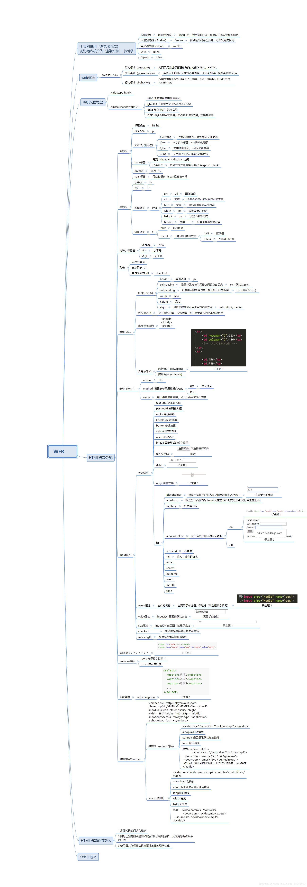
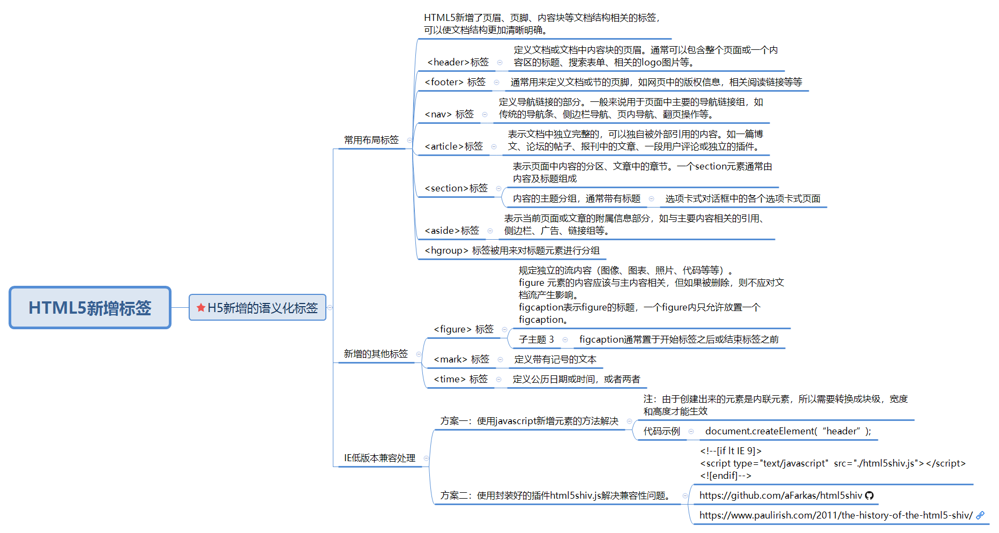

## HTML

> 这基础的东西就几张图啦，大家练武全靠勤奋啦:smirk::smirk:。(这图肯定是我偷的啦，大家不要介意，我是货比三家才偷的这一家)

### 新增语义化标签

> 这东西不知道面试还会不会问到，刚毕业出来找工作那会儿。就有面试官会问到，现在应该不会有了。

### 块级元素与行内元素

> 区别汇总

|    |是否独占一行|width、height | padding、margin | 默认高度|
|--- | ---------|------------- | -------------- | -----|
|块级元素|是|有效|有效|撑满父元素|
|行内元素|否|无效|padding有效；margin水平方向有效，竖直方向无效|随内部元素的内容变化|
|行内块级元素|否|有效|有效|随内部元素的内容变化|

>块级元素：

独占一行；元素的宽高、以及内外边距都可设置；元素宽度在不设置的情况下，是它本身父容器的100%。
**常见块级元素：**
div , h1---h6 , p , ul , ol , dl , table , form
> 行内元素：

不会自动进行换行；元素的宽高不可设置；内边距可以设置、外边距水平方向有效，竖直方向无效；元素宽度在不设置的情况下，随内部元素的内容变化。
**常见行内元素：**
span , a  ,strong  ,b ,em  , i  , big  ,small  ,label ,img , input  , select ,textarea
>行内元素与块级元素间的相互转换:

行内元素和块级元素都不是绝对的，可以相互转换,，通常有这些方式可以转换。

1. display，将元素设置为块级、行内或是其它。
2. float，隐形地把内联元素转换为行内块级元素。不会占据一行，相当于display：inline-block;
3. position,属性值为absolute、fixed 时,隐形地把内联元素转换为块级元素，其它属性值不会做转换。

### 参考链接

- [html脑图出处](https://blog.csdn.net/weixin_45659402/article/details/110677359)
- [语义化脑图出处](https://www.cnblogs.com/shihaiying/p/13045443.html)
- [块级元素与行内元素](https://juejin.cn/post/6844903593955328007)
