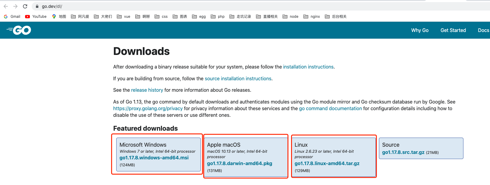
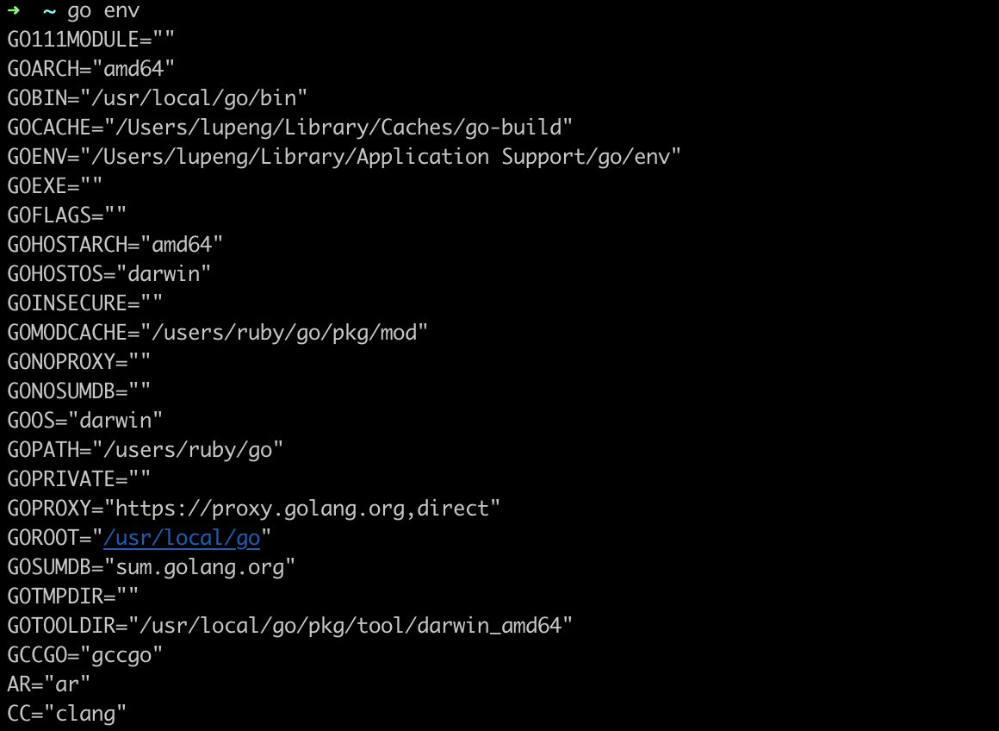
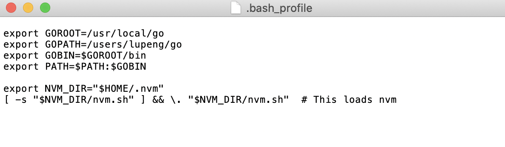

## Golang 语言的官网

首先我们登录 Golang 的[官方网站](https://golang.org/),当然你也可以登录 Golang 的[国内网站](https://golang.google.cn/)。
在 Mac、Windows 和 Linux三个平台上都支持 Golang。
您可以您可以从[下载](https://golang.org/dl/)相应平台的安装包。该网站在国内不容易访问，所以可以访问[中国对应的网站](https://golang.google.cn/dl/)或者是 [Go 语言中文网](https://www.studygolang.com/dl) 进行安装软件的下载。



### Mac 安装配置

1. **Golang 官网，进入下载页面，选择对应自己操作系统的版本下载安装。我是使用Homebrew 直接使用`brew install go` 来安装。安装成功后，在命令行输入 `go env`或者查看Go 版本`go version` 验证是否成功**。成功安装如下图所示：



咱们`cd /usr/local/go` 会看到安装Go生成的文件。

2. **配置环境变量**

安装成功后一般不需要配置环境变量，如果需要可以按一下方式进行配置。

命令输入 `open -e .bash_plofile` 编辑输入
```
export GOROOT=/usr/local/go
export GOPATH=/users/ruby/go
export GOBIN=$GOROOT/bin
export PATH=$PATH:$GOBIN
```

保持后，输入`source ~/.bash_profile`文件，使之生效

:warning::warning: 如果未找到.bash_plofile文件，可通过命令`touch .bash_profile`

