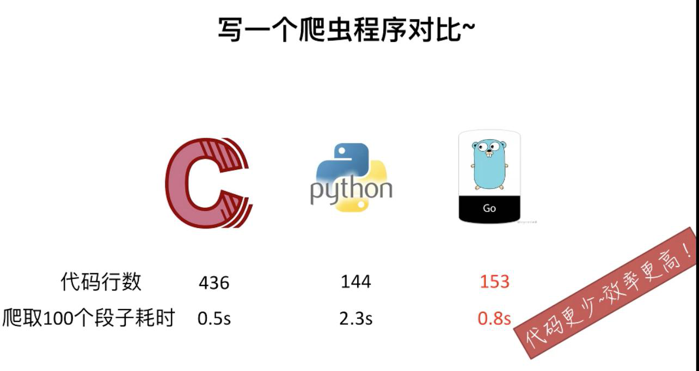

# 简介

Go语言（或 Golang）起源于 2007 年，并在 2009 年正式对外发布。Go是非常年轻的一门语言，它的主要目标是“兼具 Python 等动态语言的开发速度和 C/C++ 等编译型语言的性能与安全性”。

Go语言是编程语言设计的又一次尝试，是对类C语言的重大改进，它不但能让你访问底层操作系统，还提供了强大的网络编程和并发编程支持。Go语言的用途众多，可以进行网络编程、系统编程、并发编程、分布式编程。

Go语言的推出，旨在不损失应用程序性能的情况下降低代码的复杂性，具有“部署简单、并发性好、语言设计良好、执行性能好”等优势，目前国内诸多 IT 公司均已采用Go语言开发项目。

> Go语言的设计作者:point_right::point_right:

- Rob Pike :曾是贝尔实验室的Unix团队，和Plan 9操作系统计划的成员。 他与Thompson共事多年，并共创出 广泛使用的UTF-8字元编码。
- Robert Griesemer :在开发Go之前是Google V8、Chubby和HotSpot JVM的 主要贡献者。
- Ken Thompson :主要是B语言、C语 言的作者、Unix之父。1983年图灵奖和1998年美国国家技术奖得主。他 与Dennis Ritchie是Unix的原创者

> Go语言设计的初衷为了解决当时Google开发遇到的问题

1. 编译慢
2. 大量的C++代码，同时又引入了Java和Python
3. 更新的花费越来越长
4. 分布式的编译系统

> Go语言的优势

1. 学习曲线容易（Go语言—C/C++工程师的福音，Go语言可以让C/C++程序员的开发速度更快！更容易!同时Go能给你带来媲美C的高性能）
2. 效率：快速的编译时间，开发效率和运行效率高
3. 并行和异步编程几乎无痛点
4. 自由高效：组合的思想、无侵入式的接口
5. 强大的标准库
6. 部署方便：二进制文件，Copy部署
7. 稳定性

## Go语言的核心特性

1. 高效的并发编程
2. 内存回收(GC)
3. 编译速度快
4. 函数多返回值
5. 语言交互性
6. 没有异常处理(Error is value)

### 并发编程

- Go语言在并发编程方面比绝大多数语言要简洁不少，这一点是其最大最点之一，也是其
在未来进入高并发高性能场景的重要筹码。
- golang的并发执行单元是一种称为goroutine
的协程

### 内存回收(GC)

- 内存自动回收，再也不需要开发人员管理内存
- 开发人员专注业务实现，降低了心智负担
- 只需要new分配内存，不需要释放

### 内存分配

- 先分配一块大内存区域
- 大内存被切分成各个大小等级的块，放入不同的空闲list中
- 对象分配空间时从空闲list中取出大小合适的内存块
- 内存回收时，会把不用的内存重放回空闲list
- 空闲内存会按照一定策略合并，以减少碎片

### 编译

> 目前Golang具有两种编译器

- 一种是建立在GCC基础上的Gccgo
- 另外一种是分别针对64位x64和32位x86计算机的一套编译器（6g和8g）

### 网络编程

- socket用net.Dial(基于tcp/udp，封装了传统的connect、listen、 accept 等接口)
- http用http.Get/Post()
- rpc用client.Call('class_name.method_name', args, &reply)

### 函数多返回值

- 允许函数返回多个值，在某些场景下，可以有效的简化编程。
- GO语言推荐的编程风格，是函数返回的最后一个参数为error类型（只要逻辑体中可能出现异常），
这样，在语言级别支持多返回值，就很有必要了。

### 语言交互性

- 语言交互性指的是本语言是否能和其他语言交互，比如调用用其他语言编译的库。
- Go可以和C程序交互。

### 异常处理

> 3个重要关键字defer、panic、recover

- defer是函数结束后执行，呈先进后出；
- panic是程序出现无法修复的错误时使用，但会让defer执行完；
- recover会修复错误，不至于程序终止。当不确定函数不会出错时使用 defer+recover

### 其他一些有趣的特性

- 类型推导
- 接口 interface
- defer机制
- “包〃的概念
- 交叉编译

## 对比其他语言

- Java:作为编程语言中的大腕。具有最大的知名度和用户群。
- C#：执行速度快（4.28），学习难度适中，开发速度适中。
- C/C++:执行速度最快无人能及，但是写起来最为复杂，开发难度也很大
- JavaScript：前端处理能力是其它语言无法比拟。
- Scala：编译语言，比python快十倍，和java差不多，但是学习进度慢。
- Python：速度最慢（258s），代码简洁、学习进度短，开发速度快。

## Go语言能做什么

- 服务器编程，以前你如果使用c或者C++做的那些事情，用Go来做很合适,
- 例如处理日志、数据打包、虚拟机处理、文件系统等。
- 分布式系统、数据库代理器、中间件等，例如Etcd。
- 网络编程，这一块目前应用最广，包括Web应用、API应用、下载应用。
- 数据库操作，tidb , influxdb , cockroachdb等。

采用Go的一些国外公司，如Google、Docker、Kubernetess
Apple、Cloud Foundry、CloudFlare、Couchbase、CoreOS、Dropbox、 MongoDB、AWS、Uber等公司；
采用Go开发的国内企业：如阿里云CDN、百度、腾讯、小米、滴滴、美 团、七牛、PingCAP、华为、金山软件、猎豹移动、饿了么等公司。

采用Go的一些国外公司，如Google、Docker、Kubernetess
Apple、Cloud Foundry、CloudFlare、Couchbase、CoreOS、Dropbox、 MongoDB、AWS、Uber等公司；
采用Go开发的国内企业：如阿里云CDN、百度、腾讯、小米、滴滴、美 团、七牛、PingCAP、华为、金山软件、猎豹移动、饿了么等公司。

### Go语言在未来不可限量

- Go语言易上手
- Go语言解决了并发编程和写底层应用开发效率的痛点。
- Go语言有Google这个世界一流的技术公司在后面。
- Go语言的杀手级应用是Docker，而Docker的生态在这几年完全爆棚了。

## 总结

Go称得上是一门快、准、狠的语言了。Go它是基于编译垃圾收集和并发的编程语言，Go语言专门针对多处理器系统应用程序的编程进行优化，使用go编译的程序**可以媲美C或C++代码的速度**，而且**更加安全，支持并行进程**。作为出现在21世纪的语言，Go的执行性能和近解释型语言的开发效率，以及几乎完美的编译速度已经风靡全球。特别是在云项目中，大部分都是用Golang来开发，不得不说Golang早已深入人心。而对于一个没有历史负担的新项目，Golang或许就是个不二的选择。很多人将Go语言称为21世纪的新语言，因为Go不仅拥有C的简洁和性能，而且还很好的提供了21世纪，互联网环境下服务端开发了各种实用特性。如今Go语言已经是云计算编程语言的首选。

> Go语言的整体设计哲学**将简单、实用体现得淋漓尽致**

由Go语言实现的大型项目，如下图所示:point_down::point_down:，相信大家都不陌生！
