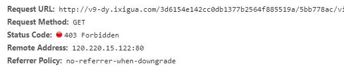
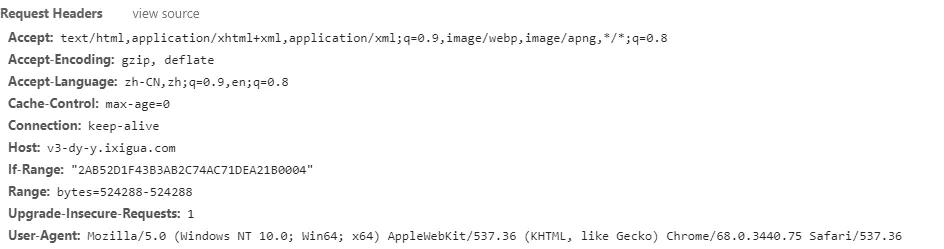
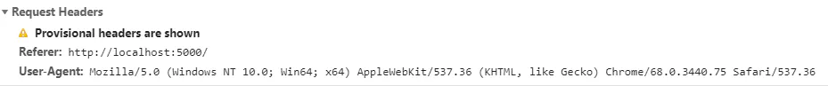

### 路由跳转被拦截，链接报错等

>在微信或企业微信打开的H5页面，常常遇到跳转某个链接没反应，或者直接报错拦截。

- 小小思路一：
    使用a标签跳转。（没错就一句话:smirk:）

>在第三方构建的应用中，某些线上资源引入被拦截

- 小小思路一：
  将需要引入的链接在图片标签中的src使用

>最近在做一个播放抖音视频的网页中遇到一个问题,抖音视频的url直接在浏览器中打开是没有问题的,直接打开本地的.html文件也是可以正常播放视频的,但访问服务器上的请求过来的页面就无法播放视频，浏览器里按F12查看network发现video标签里的src请求视频资源时报403 Forbiddn 错误。



**直接访问链接的请求头**



**出错的请求头**



经过对比发现错误的请求头中多了个Referer字段，
估计请求的是服务器 referer 做了判断，不是正常的referer就拒绝了，可以模拟他们的 referer 请求试下，测试发现, 通过 https 站点打开的页面, 可以正常打开视频链接，在 https 下, 发送的请求是不会带有 Referer 的header 的, 这个时候是可以正常加载视频的. 所以, 我们在页面的 head 标签内, 增加一行代码,指定浏览器任何情况下都不发送Referer,这样就可以正常加载资源了。
[referrer相关知识](https://developer.mozilla.org/zh-CN/docs/Web/HTTP/Headers/Referer-Policy)

- 小小思路一：
  `<meta name="referrer" content="no-referrer">`

- 小小思路二：
  **替换链接实现访问链接时不带上referer**
  ```
  const parm = '\u003cscript\u003elocation.replace("' + url + '")\u003c/script\u003e';//相当于 <script>location.replace("'+url+'")</script>
  const str = 'javascript:window.name;'
  window.open(str, parm);```
