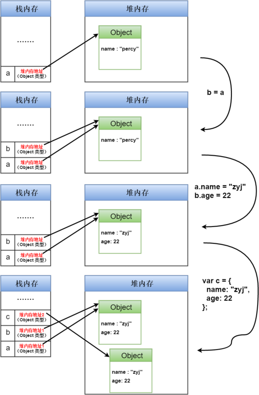

# 内置类型

## 概述

ECMAScript 规范规定语言类型有六种 `Undefined，Null，Boolean，String，Number，和 Object`，
ES6 又添加了一种基本类型，叫`Symbol`。

其中 Object 是引用类型，其他是基本类型。他们的划分方式其实是其是否可以表示为固定长度，
比如`Undefined，Null，Boolean，String，Number` 这些可以有固定长度，因此是基本类型，并且保存到了栈上。
`Object` 由于不可预知长度，并且可以 mutate，因此算引用类型，会被分配到了另一块区域，我们称之为堆（heap）。
有同学就会疑惑了`String`类型的长度是不固定的啊？但是**字符串是不可变的，因此被认为有固定长度。** 就好比武术招式，就算你能一分钟内打一个招式七八遍，总归还是一招，因为你的招式没有变化。（:point_right::point_right:译注：如，JavaScript 中对字符串的操作一定返回了一个新字符串，原始字符串并没有被改变）。




## Undefined

一个没有被赋值的变量会有个默认值`undefined`。如果方法或者是语句中**操作的变量没有被赋值，则会返回undefined** 
```function test(t) {
  if (t === undefined) {
    return 'Undefined value!';
  }
  return t;
}
d
let x;
console.log(test(x));// expected output: "Undefined value!"
```
undefined是全局对象的一个属性。也就是说，它是全局作用域的一个变量。undefined的最初值就是原始数据类型undefined。

## 布尔类型

布尔表示一个逻辑实体，可以有两个值：`true` 和 `false`。

## Null 类型

值 null 是一个字面量，不像 undefined，它不是全局对象的一个属性。null 是表示缺少的标识，指示变量未指向任何对象。把 null 作为尚未创建的对象，也许更好理解。在 API 中，null 常在返回类型应是一个对象，但没有关联的值的地方使用。

## 参考文档

[JavaScript 深入了解基本类型和引用类型的值](https://www.runoob.com/w3cnote/javascript-basic-types-and-reference-types.html)
[MDN:JavaScript 数据类型和数据结构](https://developer.mozilla.org/zh-CN/docs/Web/JavaScript/Data_structures)
