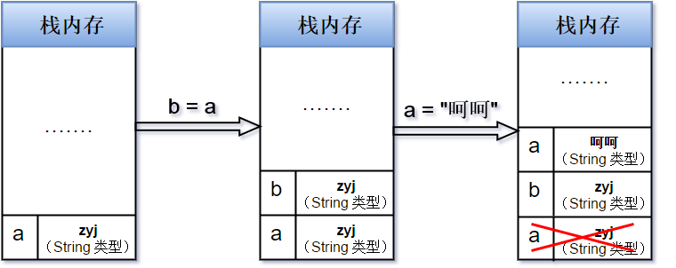

# 内置类型

## 概述

ECMAScript 规范规定语言类型有六种 `Undefined，Null，Boolean，String，Number，和 Object`，
ES6 又添加了一种基本类型，叫`Symbol`。

其中 Object 是引用类型，其他是基本类型。他们的划分方式其实是其是否可以表示为固定长度，
比如`Undefined，Null，Boolean，String，Number` 这些可以有固定长度，因此是基本类型，并且保存到了栈上。
`Object` 由于不可预知长度，并且可以 mutate，因此算引用类型，会被分配到了另一块区域，我们称之为堆（heap）。
有同学就会疑惑了`String`类型的长度是不固定的啊？但是**字符串是不可变的，因此被认为有固定长度。**就好比武术招式，就算你能一分钟内打一个招式七八遍，总归还是一招，因为你的招式没有变化。

## 参考文档

[JavaScript 深入了解基本类型和引用类型的值](https://www.runoob.com/w3cnote/javascript-basic-types-and-reference-types.html)

